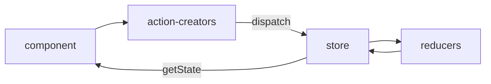

* 依赖
  ```shell

  yarn add redux
  yarn add react-redux
  yarn add redux-thunk  // 中间件， 让redux支持异步函数   

  ```    
-------
* 关键点
  - index.js： store subscribe 检测到组件属性变化，重新渲染组件
  - 组件引入store并调用store.dipatch调度reducer.js的方法, 以action.js里面的方法返回值为参数
    1. store接收一般object {type, data} 参数， 如果传入异步函数， 需要引入redux-thunk并建立关系
  - 组件通过store.getState() 获取redux reducer计算的结果

-----
* #### redux 流程图

